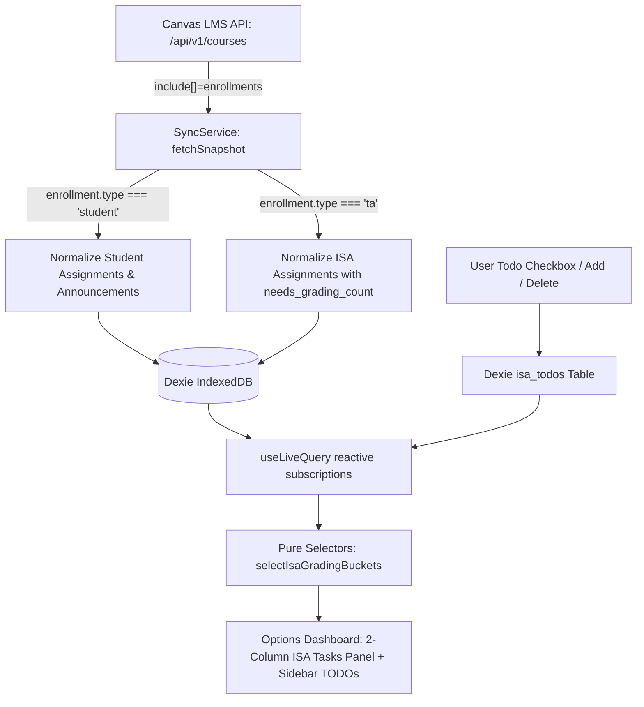

# ISA Tasks Integration Plan

## Active Phase

Phase 6: Full Verification Gate & Release Preparation (Complete)

## System Architecture

## Dependency Chains & Affected Files

1. `src/domain/models.ts` - Add `CourseEnrollmentType`, `IsaAssignmentRecord`, `IsaTodoRecord`, extend `RemoteSnapshot`.
2. `src/domain/normalization.ts` - Parse `enrollments` on raw course; normalize ISA assignments with `needs_grading_count` and `speedgrader_url`.
3. `src/storage/database.ts` - Database schema version 2 adding `isa_assignments` and `isa_todos` tables.
4. `src/storage/repository.ts` - Snapshot replacement for ISA assignments; CRUD helpers for `isa_todos`.
5. `src/sync/sync-service.ts` - Query `/api/v1/courses` with `include[]=enrollments`; branch assignment fetching for TA courses.
6. `src/dashboard/selectors.ts` - Pure selectors for ISA grading queues (`toBeGraded`, `completedGrading`) and badge counts.
7. `entrypoints/options/App.tsx` - Navbar tab addition, 2-column layout, speedgrader links, and persistent TODO checklist.
8. `tests/spec/` - Strict TDD contract assertion suites for each layer.

## Exit Criteria

- `npm run check` passes with 0 lint errors, 0 type errors, 0 test failures.
- Student agenda and ISA tasks are strictly isolated without cross-contamination.
- SpeedGrader direct URLs strictly match exact Canvas host origin.
- ISA quick TODOs persist across extension reloads.
