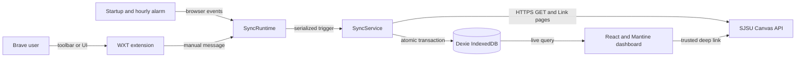

# Better Canvas View Codebase Overview

> A Manifest V3 extension that reads SJSU Canvas through the existing browser
> session, atomically caches normalized coursework, and renders a local agenda.

**Last Updated:** 2026-08-24

**Primary Language & Runtime:** TypeScript 6, React 19, Node.js 20+ tooling

**Architecture Pattern:** Modular browser-extension monolith

## 1. Architecture Overview

The WXT background service worker is the only Canvas network boundary. Toolbar,
startup, hourly-alarm, and manual events reach `SyncRuntime`, which serializes
trigger dispatch through `SyncService`. The service reads every paginated API
resource before one Dexie transaction replaces the remote snapshot and success
metadata. Failed synchronization updates failure metadata but retains the prior
snapshot. The Options-page React application observes IndexedDB directly through
Dexie live queries; pure selectors derive agenda, announcement, hidden-item, and
stale-state views.



State has three ownership classes:

- Canvas-owned snapshots: courses, agenda items, and announcements.
- User-owned local state: course preferences, hidden flags, and notes.
- Synchronization state: last attempt, last success, status, error code, and
  aggregate record counts.

## 2. Tech Stack and Constraints

| Layer           | Technology                          | Constraints and implementation notes                               |
| :-------------- | :---------------------------------- | :----------------------------------------------------------------- |
| Extension       | WXT `^0.21.4`, Chrome MV3           | Options page opens in a tab; background is a service worker.       |
| UI              | React `^19.2.8`, Mantine `^9.5.2`   | Dark token palette; durable state must not be duplicated in React. |
| Storage         | Dexie `^4.4.5`, IndexedDB           | Remote snapshot and success metadata commit atomically.            |
| Transport       | Native `fetch`, Canvas REST API     | GET-only, exact HTTPS origin, opaque validated pagination links.   |
| Time            | Native `Intl`                       | All bucketing and display use `America/Los_Angeles`.               |
| Unit tests      | Vitest `^4.1.11`, jsdom             | `tests/spec/` assertions are immutable contracts.                  |
| Browser tests   | Playwright `^1.62.1`                | Temporary Chromium profile and test-only fake Canvas transport.    |
| Static analysis | ESLint 10, TypeScript 6, Prettier 3 | Strict types, zero lint warnings, LF line endings.                 |

The extension has no application server, cloud deployment, token store,
content script, or frontend HTTP cache. Brave's authenticated session and the
extension's IndexedDB origin are environment dependencies.

## 3. Entry Points and Lifecycle

| Surface      | Invocation                      | Lifecycle                                                                                                 |
| :----------- | :------------------------------ | :-------------------------------------------------------------------------------------------------------- |
| Background   | `entrypoints/background.ts`     | Composes Canvas client, Dexie, sync service/runtime, toolbar, diagnostics, startup, messages, and alarms. |
| Dashboard    | `entrypoints/options/main.tsx`  | Opens as `options.html`, creates database `better-canvas-view`, and mounts `App`.                         |
| Toolbar      | Extension action                | Calls `browser.runtime.openOptionsPage()`.                                                                |
| Startup sync | `browser.runtime.onStartup`     | Verifies alarm and queues a `startup` snapshot.                                                           |
| Hourly sync  | `chrome.alarms`                 | Uses `better-canvas-view-hourly-sync` at 60-minute periods.                                               |
| Manual sync  | `RUN_CANVAS_SYNC` message       | Returns the caller's `SyncResult` to the dashboard.                                                       |
| Diagnostic   | `RUN_CANVAS_DIAGNOSTIC` message | Tests authenticated Canvas JSON without logging payloads.                                                 |

`SyncRuntime.initialize()` is idempotent. It registers listeners once and
recreates a missing or incorrectly configured alarm. `SyncService.run()` uses a
failure-safe Promise tail so overlapping triggers execute in arrival order and
a failed run cannot poison the queue.

## 4. Key Modules

| Path                          | Architectural responsibility                                                |
| :---------------------------- | :-------------------------------------------------------------------------- |
| `src/canvas/client.ts`        | Fixed-origin GET client, response/auth validation, retries, and pagination. |
| `src/canvas/pagination.ts`    | Extracts opaque `rel=next` continuation URLs.                               |
| `src/sync/sync-service.ts`    | Fetches complete course snapshots and owns commit/failure semantics.        |
| `src/sync/runtime.ts`         | Adapts alarms/messages to serialized synchronization triggers.              |
| `src/domain/normalization.ts` | Converts Canvas payloads into stable snake_case records.                    |
| `src/domain/submissions.ts`   | Classifies submitted, graded, pending-review, and excused work.             |
| `src/domain/agenda.ts`        | Assigns each due date to one Pacific-time agenda bucket.                    |
| `src/storage/database.ts`     | Defines the versioned six-store Dexie schema.                               |
| `src/storage/repository.ts`   | Owns atomic snapshot replacement and local-state mutations.                 |
| `src/dashboard/selectors.ts`  | Purely derives enabled, visible, hidden, grouped, and stale views.          |
| `entrypoints/options/App.tsx` | Renders dashboard workflows and transient UI state.                         |
| `src/security/`               | Converts Canvas markup to text and validates exact-origin links.            |

> [!WARNING]
> Changes to `src/domain/submissions.ts` can silently hide outstanding work.
> Require a new regression contract for every submission-state change.

> [!WARNING]
> Changes to `src/sync/sync-service.ts` or `src/storage/repository.ts` can pair
> partial data with success metadata or allow an older snapshot to win. Run the
> concurrency, rollback, and full browser suites after any edit.

> [!WARNING]
> `src/canvas/client.ts`, `src/security/canvas-links.ts`, and
> `src/security/announcement-text.ts` enforce the remote trust boundary. Never
> relax exact-origin, content-type, or inert-text validation for convenience.

## 5. Canvas Integration Contract

`SyncService` queries active student courses with term metadata. For every
course it serially requests assignments with submission state and discussion
topics restricted to announcements. `CanvasHttpClient.getAll()` follows only
absolute `https://sjsu.instructure.com/api/v1/...` next links, detects cycles,
and rejects off-origin, relative, or non-API continuations.

Response behavior:

- 401, 403, redirects, or non-JSON success content become `auth_required`.
- HTTP 429 and transient 5xx responses retry up to three attempts.
- `Retry-After` is respected and bounded to 30 seconds.
- Ordinary 4xx, malformed JSON, wrong shapes, and unsafe pagination become
  `invalid_response`.
- Errors expose stable codes only; Canvas payloads and credentials are not
  logged or persisted as diagnostics.

Assignments, Classic Quizzes, New Quizzes, external tools, and due-dated graded
discussions normalize into agenda items. Undated discussions remain excluded.
`omit_from_final_grade` does not exclude an otherwise actionable assignment.
Canvas submission state is authoritative after a successful refresh.

## 6. Persistence Model

Dexie schema version 1 defines six stores:

| Store                | Key and indexes                         | Ownership                                 |
| :------------------- | :-------------------------------------- | :---------------------------------------- |
| `courses`            | `&id`, course ID, name, code            | Remote snapshot                           |
| `agenda_items`       | `&id`, course, due date, type, complete | Remote snapshot                           |
| `announcements`      | `&id`, course, posted time              | Remote snapshot                           |
| `course_preferences` | `&id`, enabled                          | Local user state                          |
| `item_states`        | `&id`, hidden                           | Local user state; notes are stored values |
| `sync_metadata`      | singleton `&id`, status, success time   | Synchronization state                     |

Normalized IDs use `${courseId}:${objectId}`. Course preferences use the same
stable-key shape (`${courseId}:${courseId}`). A successful refresh clears and
replaces only the three remote stores, creates enabled preferences for newly
seen courses, and commits metadata in the same transaction. Local preferences,
notes, and hidden state survive refreshes. Clear Data atomically clears all six
stores but never touches Canvas or browser cookies.

## 7. Dashboard Derivation

`useLiveQuery` reads every durable table. React state is limited to title/course
filters, note drafts, refresh feedback, and modal visibility. Selectors enforce
enabled-course filtering before rendering.

Each incomplete, visible agenda item belongs to exactly one ordered bucket:
overdue, today, tomorrow, days 2-7, days 8-14, day 15 onward, or undated.
Earlier-today deadlines are overdue. Calendar-day boundaries use Pacific time,
while overdue comparison uses the exact instant. Due labels include the Canvas
date, time, and PST/PDT abbreviation.

Announcements are grouped by enabled course and sorted newest first. The stored
Canvas message remains inert data; `DOMParser` removes executable/non-visible
elements and React renders only normalized text. Deep links render only after
exact-origin validation.

## 8. Non-Obvious Patterns

- **Snapshot before mutation:** Never stream course results into IndexedDB. One
  failed later course must retain the previous complete snapshot.
- **Success metadata is data:** Store successful counts/timestamps in the same
  transaction as the snapshot, not in a follow-up write.
- **Failure metadata is separate:** A failed refresh updates only attempt/error
  state and preserves the prior `last_success_at` and remote records.
- **Serialized triggers:** Do not replace the Promise tail with concurrent
  requests or trigger coalescing; callers require their own ordered results.
- **Dynamic default fetch:** The client delegates through `globalThis.fetch` at
  request time so isolated service-worker tests can install transport routing.
- **Canvas links are data:** Never render arbitrary `html_url` values or use
  `dangerouslySetInnerHTML`; validate URLs and render announcements as text.
- **Tests are layered:** New behavior starts in `tests/spec/`; implementation or
  cleanup work must not weaken or delete existing assertions.

## 9. Development and Verification

Install and prepare generated WXT types:

```powershell
npm install
```

Run the development builder:

```powershell
npm run dev
```

Run the complete non-browser quality gate:

```powershell
npm run check
```

Run isolated extension workflows after a successful production build:

```powershell
npm run test:e2e
```

Useful focused commands:

```powershell
npm run test:spec
npm run test:integration
npm run test:coverage
npm run format
```

`npm run check` executes Prettier check, ESLint with zero warnings, strict
TypeScript, all Vitest files, and `wxt build`. Playwright loads
`.output/chrome-mv3` into a temporary persistent Chromium profile, patches only
the isolated service worker's Canvas transport, and removes the profile after
each test.

There is currently no `.github/workflows` CI configuration. These gates are
local release requirements and must be run before the feature branch is pushed.

## 10. Architecture Decisions

The full ADR ledger is local project guidance in `.agent-tasks/DECISIONS.md`.
Load-bearing accepted decisions include:

- Exact-host, tokenless MV3 extension over token storage, DOM scraping, a local
  server, or automation of the everyday browser profile.
- WXT, React, Mantine, and Dexie for extension lifecycle, UI, and structured
  local persistence.
- Complete snapshot validation and atomic replacement over incremental remote
  writes.
- Pure dashboard selectors and Dexie live queries over logic embedded directly
  in React render paths or a second client cache.
- Temporary-profile Playwright E2E with a test-boundary fake transport over
  production mock hooks or real Canvas credentials.

## 11. Domain Glossary

| Term            | Definition here                                                             | Not this                           |
| :-------------- | :-------------------------------------------------------------------------- | :--------------------------------- |
| Agenda item     | Normalized assignment, quiz, external tool, or due-dated graded discussion. | Announcement or calendar event.    |
| Remote snapshot | Last complete validated Canvas course/assignment/announcement read.         | A partial per-course cache.        |
| Item state      | Local hidden flag and optional note keyed by stable Canvas IDs.             | Canvas submission state.           |
| Complete        | Submitted, graded, pending review, or excused according to Canvas.          | Merely overdue, late, or missing.  |
| Hidden          | User-local suppression reversible from Hidden Items.                        | Deletion from Canvas or IndexedDB. |
| Stale           | Last refresh failed or last success is more than two hours old.             | Cache automatically discarded.     |

## 12. Before Changing Code

1. Read `.agent-tasks/REQUIREMENTS.md`, `PLAN.md`, `DECISIONS.md`, and
   `TASKS.md`; they are intentionally ignored by Git but define current scope.
2. Add a new failing assertion without modifying existing `tests/spec/`
   contracts. Share `tests/fixtures/canvas-golden.json` where formats overlap.
3. Keep Canvas operations GET-only and retain the exact manifest permission
   surface in `wxt.config.ts`.
4. Run `npm run check`, `npm run test:e2e`, `npm audit --audit-level=high`, and
   inspect `.output/chrome-mv3/manifest.json` before release preparation.
5. Never automate the everyday Brave profile. Live SJSU verification is a
   manual owner smoke test using the unpacked production extension.

### Documentation Staleness Risks

| Risk               | Drift trigger                     | Audit                                               |
| :----------------- | :-------------------------------- | :-------------------------------------------------- |
| Package versions   | `package.json` dependency updates | Recheck the stack matrix after lockfile changes.    |
| Dexie schema       | New database version or stores    | Compare section 6 with `src/storage/database.ts`.   |
| Canvas queries     | Sync endpoint/query changes       | Compare section 5 with `src/sync/sync-service.ts`.  |
| Permissions        | WXT manifest changes              | Inspect the built manifest, not only source config. |
| Tests and commands | Script/config changes             | Run every documented command before release.        |
