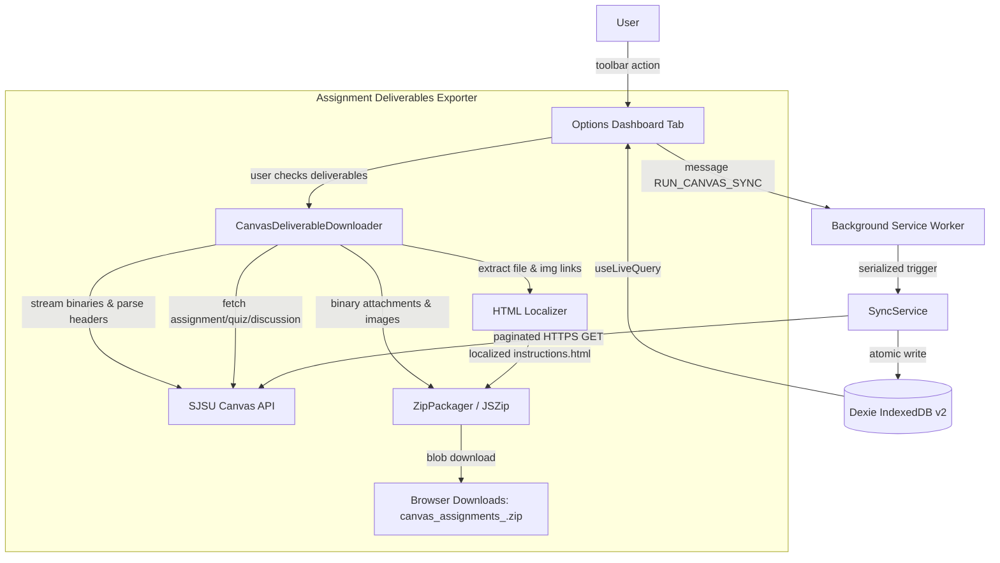

# Better Canvas View Codebase Overview

> A Manifest V3 extension that reads SJSU Canvas through the existing browser
> session, atomically caches normalized coursework, and renders a local agenda,
> ISA grading workspace, and offline deliverable packaging engine.

**Last Updated:** 2026-09-16 (v0.3.0)

**Primary Language & Runtime:** TypeScript 6, React 19, Node.js 20+ tooling

**Architecture Pattern:** Modular browser-extension monolith

## 1. Architecture Overview

The WXT background service worker is the primary Canvas network boundary. Toolbar,
startup, hourly-alarm, and manual events reach `SyncRuntime`, which serializes
trigger dispatch through `SyncService`. The service reads every paginated API
resource before one Dexie transaction replaces the remote snapshot and success
metadata. Failed synchronization updates failure metadata but retains the prior
snapshot. The Options-page React application observes IndexedDB directly through
Dexie live queries; pure selectors derive agenda, announcement, ISA grading tasks,
hidden-item, and stale-state views.

Additionally, v0.3.0 introduces a client-side **Assignment Deliverables Exporter**
orchestrated from the Options dashboard. It queries Canvas deliverable descriptions,
canonicalizes file URLs, resolves server filenames via `Content-Disposition` headers,
downloads embedded image binaries, rewrites HTML for offline viewing, and compresses
all deliverables into a structured master ZIP file using `jszip`.



State has four ownership classes:

- Canvas-owned snapshots: courses, agenda items, announcements, and ISA assignments.
- User-owned local state: course preferences, hidden flags, notes, and ISA todo items.
- Synchronization state: last attempt, last success, status, error code, and record counts.
- Transient export state: active selection mode, selected IDs, download progress, and issues.

## 2. Tech Stack and Constraints

| Layer           | Technology                          | Constraints and implementation notes                               |
| :-------------- | :---------------------------------- | :----------------------------------------------------------------- |
| Extension       | WXT `^0.21.4`, Chrome MV3           | Options page opens in a tab; background is a service worker.       |
| UI              | React `^19.2.8`, Mantine `^9.5.2`   | Dark token palette; durable state must not be duplicated in React. |
| Storage         | Dexie `^4.4.5`, IndexedDB           | Schema v2 (8 stores). Remote snapshots commit atomically.          |
| Export & Zip    | JSZip `^3.10.2`                     | Client-side in-memory compression; no backend processing.          |
| Transport       | Native `fetch`, Canvas REST API     | GET-only, exact HTTPS origin, opaque validated pagination links.   |
| Time            | Native `Intl`                       | All bucketing and display use `America/Los_Angeles`.               |
| Unit tests      | Vitest `^4.1.11`, jsdom             | `tests/spec/` assertions are immutable contracts (111 tests).      |
| Browser tests   | Playwright `^1.62.1`                | Temporary Chromium profile and test-only fake Canvas transport.    |
| Static analysis | ESLint 10, TypeScript 6, Prettier 3 | Strict types, zero lint warnings, LF line endings.                 |

The extension has no application server, cloud deployment, token store,
content script, or frontend HTTP cache. Brave's authenticated session and the
extension's IndexedDB origin are environment dependencies.

## 3. Entry Points and Lifecycle

| Surface      | Invocation                      | Lifecycle                                                                                                 |
| :----------- | :------------------------------ | :-------------------------------------------------------------------------------------------------------- |
| Background   | `entrypoints/background.ts`     | Composes Canvas client, Dexie, sync service/runtime, toolbar, diagnostics, startup, messages, and alarms. |
| Dashboard    | `entrypoints/options/main.tsx`  | Opens as `options.html`, creates database `better-canvas-view`, and mounts `App`.                         |
| Toolbar      | Extension action                | Calls `browser.runtime.openOptionsPage()`.                                                                |
| Startup sync | `browser.runtime.onStartup`     | Verifies alarm and queues a `startup` snapshot.                                                           |
| Hourly sync  | `chrome.alarms`                 | Uses `better-canvas-view-hourly-sync` at 60-minute periods.                                               |
| Manual sync  | `RUN_CANVAS_SYNC` message       | Returns the caller's `SyncResult` to the dashboard.                                                       |
| Diagnostic   | `RUN_CANVAS_DIAGNOSTIC` message | Tests authenticated Canvas JSON without logging payloads.                                                 |

`SyncRuntime.initialize()` is idempotent. It registers listeners once and
recreates a missing or incorrectly configured alarm. `SyncService.run()` uses a
failure-safe Promise tail so overlapping triggers execute in arrival order and
a failed run cannot poison the queue.

## 4. Key Modules

| Path                               | Architectural responsibility                                                |
| :--------------------------------- | :-------------------------------------------------------------------------- |
| `src/canvas/client.ts`             | Fixed-origin GET client, response/auth validation, retries, and pagination. |
| `src/canvas/pagination.ts`         | Extracts opaque `rel=next` continuation URLs.                               |
| `src/sync/sync-service.ts`         | Fetches complete course snapshots and owns commit/failure semantics.        |
| `src/sync/runtime.ts`              | Adapts alarms/messages to serialized synchronization triggers.              |
| `src/domain/normalization.ts`      | Converts Canvas payloads into stable snake_case student & ISA records.      |
| `src/domain/submissions.ts`        | Classifies submitted, graded, pending-review, and excused work.             |
| `src/domain/agenda.ts`             | Assigns each due date to one Pacific-time agenda bucket.                    |
| `src/storage/database.ts`          | Defines the versioned eight-store Dexie schema (v1 & v2).                   |
| `src/storage/repository.ts`        | Owns atomic snapshot replacement and local-state mutations.                 |
| `src/dashboard/selectors.ts`       | Purely derives enabled, visible, hidden, grouped, and stale views.          |
| `src/dashboard/item-state-keys.ts` | Isolates local state when Canvas object-type IDs collide.                   |
| `src/export/models.ts`             | Contracts for deliverable export targets, attachments, and progress.        |
| `src/export/html-localizer.ts`     | Extracts file/image links, generates offline HTML, rewrites relative paths. |
| `src/export/canvas-downloader.ts`  | Streams deliverable data, binds global fetch, parses Content-Disposition.   |
| `src/export/zip-packager.ts`       | Assembles structured per-assignment directories and triggers ZIP download.  |
| `entrypoints/options/App.tsx`      | Renders dashboard workflows, ISA tab, export toolbar, and transient state.  |
| `src/security/`                    | Converts Canvas markup to text and validates exact-origin links.            |

> [!WARNING]
> Changes to `src/domain/submissions.ts` can silently hide outstanding work.
> Require a new regression contract for every submission-state change.

> [!WARNING]
> Changes to `src/sync/sync-service.ts` or `src/storage/repository.ts` can pair
> partial data with success metadata or allow an older snapshot to win. Run the
> concurrency, rollback, and full test suites after any edit.

> [!WARNING]
> In `src/export/canvas-downloader.ts`, `fetchFn` must always be bound to `globalThis`
> context. Calling an unbound `fetch` reference throws `Illegal invocation`.

## 5. Canvas Integration Contract

`SyncService` queries active student and ISA courses with term metadata. For every
course it serially requests assignments with submission state, discussion topics,
and ISA grading counts. `CanvasHttpClient.getAll()` follows only absolute
`https://sjsu.instructure.com/api/v1/...` next links, detects cycles, and rejects
off-origin, relative, or non-API continuations. Every fetch wait is bounded to
30 seconds.

Response behavior:

- 401, 403, redirects, or non-JSON success content become `auth_required`.
- HTTP 429 and transient 5xx responses retry up to three attempts.
- `Retry-After` is respected and bounded to 30 seconds.
- Ordinary 4xx, malformed JSON, wrong shapes, and unsafe pagination become
  `invalid_response`.
- Errors expose stable codes only; Canvas payloads and credentials are not
  logged or persisted as diagnostics.

Assignments, Classic Quizzes, New Quizzes, external tools, and due-dated graded
discussions normalize into agenda items. Undated discussions remain excluded.
`omit_from_final_grade` does not exclude an otherwise actionable assignment.
Canvas submission state is authoritative after a successful refresh. Invalid
optional Canvas timestamps normalize to `null` before persistence.

## 6. Persistence Model

Dexie schema version 2 defines eight stores:

| Store                | Key and indexes                                      | Ownership                                 |
| :------------------- | :--------------------------------------------------- | :---------------------------------------- |
| `courses`            | `&id, course_id, name, course_code, enrollment_type` | Remote snapshot                           |
| `agenda_items`       | `&id, course_id, due_at, item_type, is_complete`     | Remote snapshot                           |
| `announcements`      | `&id, course_id, posted_at`                          | Remote snapshot                           |
| `course_preferences` | `&id, enabled`                                       | Local user state                          |
| `item_states`        | `&id, hidden`                                        | Local user state; notes are stored values |
| `sync_metadata`      | singleton `&id, last_status, last_success_at`        | Synchronization state                     |
| `isa_assignments`    | `&id, course_id, due_at, needs_grading_count`        | Remote snapshot                           |
| `isa_todos`          | `&id, completed, created_at`                         | Local user state                          |

Normalized IDs use `${courseId}:${objectId}`. Course preferences use the same
stable-key shape (`${courseId}:${courseId}`). A successful refresh clears and
replaces only the remote stores (`courses`, `agenda_items`, `announcements`,
`isa_assignments`), creates enabled preferences for newly seen courses, and commits
metadata in the same transaction. Local preferences, notes, hidden state, and ISA
todos survive refreshes. Clear Data atomically clears all eight stores.

## 7. Dashboard & Export Derivation

`useLiveQuery` reads durable tables. React state is limited to search filters,
course toggles, note drafts, ISA todo drafts, and deliverable export selections.

### Student Agenda & Announcements

- Incomplete, visible agenda items belong to exactly one ordered bucket: overdue,
  today, tomorrow, days 2-7, days 8-14, day 15 onward, or undated.
- Pacific time governs day boundaries; exact instant governs overdue status.
- Announcements older than 365 days are omitted from display.

### ISA Tasks Workspace (v0.2.0)

- Isolated to courses where `enrollment_type === 'ta' | 'teacher' | 'designer'`.
- Aggregates assignments needing grading with `needs_grading_count` and deep links.
- Maintains a persistent, editable TODO checklist.

### Assignment Deliverables Exporter (v0.3.0)

- Triggered by clicking "Download Assignment Deliverables" on the Agenda tab.
- Renders checkboxes on student agenda cards with counter, Select All, and Deselect All.
- Converts Canvas file links to canonical direct download endpoints:
  `${canvasOrigin}/files/${fileId}/download?download_frd=1`.
- Extracts true filenames from `Content-Disposition` response headers (supporting RFC 5987
  `filename*=UTF-8''...` and standard quoted formats).
- Localizes HTML with embedded styling and rewrites `` tags to relative
  local assets (`attachments/images/image_N.ext`).
- Packages into `canvas_assignments_<YYYY-MM-DD>.zip` with per-deliverable folders.

## 8. Non-Obvious Patterns

- **Snapshot before mutation:** Never stream course results into IndexedDB. One
  failed later course must retain the previous complete snapshot.
- **Success metadata is data:** Store successful counts/timestamps in the same
  transaction as the snapshot, not in a follow-up write.
- **Bound Fetch Context:** `fetchFn` in `CanvasDeliverableDownloader` must be wrapped
  in `(input, init) => globalThis.fetch(input, init)` to ensure it executes with window
  context and avoids `Illegal invocation` browser DOM exceptions.
- **Canvas File Link Canonicalization:** Canvas web links (`/files/:id?wrap=1`) serve
  HTML wrappers. The exporter must rewrite them to `/files/:id/download?download_frd=1`.
- **Content-Disposition Precedence:** Generic anchor text (`"here"`, `"link"`) is
  overridden by the server's `Content-Disposition` header filename.
- **Deduplication and HTML Sync:** Attachment downloading runs _before_ HTML
  localization so that relative anchor links in `instructions.html` match the exact,
  deduplicated filenames inside the archive.
- **Serialized triggers:** Do not replace the Promise tail with concurrent
  requests; callers require their own ordered results.
- **Tests are layered:** New behavior starts in `tests/spec/`; implementation or
  cleanup work must never weaken or delete existing assertions.

## 9. Development and Verification

Install and prepare generated WXT types:

```powershell
npm install
```

Run the development builder:

```powershell
npm run dev
```

Run the complete quality gate:

```powershell
npm run check
```

Package the production extension for release:

```powershell
npx wxt zip
```

Useful focused commands:

```powershell
npm run test:spec          # Unit and contract tests
npm run test:integration   # Integration test suite
npm run test:e2e           # Isolated Playwright extension tests
npm run format             # Prettier code formatter
npm run lint               # ESLint zero-warning check
npm run typecheck          # TypeScript compiler validation
```

## 10. Architecture Decisions

Full ADR ledger is archived in `.agent-tasks/v*/DECISIONS.md`. Key decisions:

- **ADR-001**: Exact-host, tokenless MV3 extension over token storage or DOM scraping.
- **ADR-002**: WXT, React, Mantine, and Dexie for extension lifecycle, UI, and local storage.
- **ADR-003**: Complete snapshot validation and atomic replacement over incremental writes.
- **ADR-004**: ISA Tasks isolated to instructor/TA enrollments with persistent checklist.
- **ADR-005**: In-memory JSZip packaging for deliverable exports; client-side only.
- **ADR-006**: Global `fetch` execution binding to prevent browser `Illegal invocation`.
- **ADR-007**: Canonical direct download endpoints and RFC 5987 `Content-Disposition` parsing.

## 11. Domain Glossary

| Term            | Definition here                                                             | Not this                           |
| :-------------- | :-------------------------------------------------------------------------- | :--------------------------------- |
| Agenda item     | Normalized assignment, quiz, external tool, or due-dated graded discussion. | Announcement or calendar event.    |
| Remote snapshot | Last complete validated Canvas course/assignment/announcement read.         | A partial per-course cache.        |
| Item state      | Local hidden flag and optional note keyed by stable Canvas IDs.             | Canvas submission state.           |
| ISA assignment  | Assignment from an ISA course with pending submissions to grade.            | Student coursework deliverable.    |
| Deliverable     | Actionable student assignment, quiz, or discussion available for export.    | ISA grading task or announcement.  |
| Complete        | Submitted, graded, pending review, or excused according to Canvas.          | Merely overdue, late, or missing.  |
| Hidden          | User-local suppression reversible from Hidden Items.                        | Deletion from Canvas or IndexedDB. |
| Stale           | Last refresh failed or last success is more than two hours old.             | Cache automatically discarded.     |

## 12. Before Changing Code

1. Read `.agent-tasks/v0.3.0/` documents and [docs/AGENT_ONBOARDING.md](docs/AGENT_ONBOARDING.md).
2. Add a new failing assertion without modifying existing `tests/spec/` contracts.
3. Keep Canvas operations GET-only and retain the exact manifest permission surface in `wxt.config.ts`.
4. Run `npm run check` and `npm run test:e2e` before preparing releases.
5. Never automate the everyday Brave profile; live testing uses the unpacked extension in Developer Mode.
