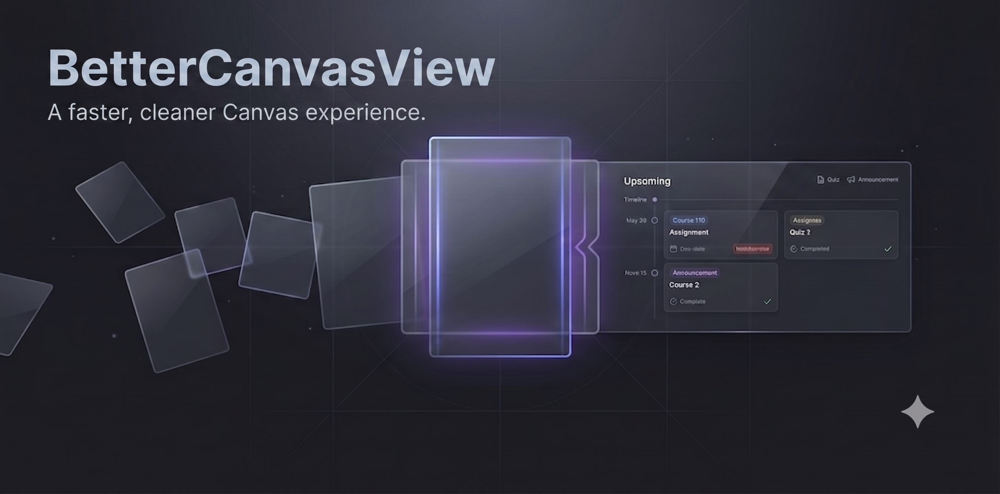

# Better Canvas View



Better Canvas View is a local, read-only Brave extension that combines upcoming
SJSU Canvas assignments, quizzes, and announcements into one desktop agenda.
It uses the Canvas session already active in Brave and stores its cache and
organization preferences only in the extension's IndexedDB database.

## Current Features

- Exclusive Pacific-time agenda groups: overdue, today, tomorrow, days 2-7,
  days 8-14, day 15 onward, and undated.
- Assignment, Classic Quiz, New Quiz, external-tool, and due-dated graded
  discussion support, including work omitted from the Canvas final grade.
- Separate announcements view with inert plain-text excerpts.
- Search, multi-course filtering, per-course enablement, notes, and reversible
  assignment or announcement hiding.
- Cached data with manual, startup, and hourly refresh plus stale/login states.

## Privacy and Scope

The extension requests only the `alarms` permission and host access to
`https://sjsu.instructure.com/*`. It does not request cookie access, read or
store Canvas credentials, inject content scripts, scrape Canvas pages, submit
coursework, or edit Canvas data.

This is a desktop, single-user, local-only viewer. Cloud hosting, phone support,
calendar views, discussions without due dates, AI prioritization, and automated
assignment completion are outside v1.

## Install in Brave

Requirements: Node.js 20 or newer, npm, and Brave signed in to
`https://sjsu.instructure.com/`.

1. Run `npm ci`.
2. Run `npm run check` to test and build the extension.
3. Open `brave://extensions` and enable Developer mode.
4. Select **Load unpacked** and choose `.output/chrome-mv3`.
5. Pin Better Canvas View and select its toolbar icon to open the dashboard.
6. Select **Refresh** to load the current Canvas snapshot.

After source changes, rerun `npm run build` and select **Reload** on the
extension card in `brave://extensions`.

## Development

```powershell
npm ci
npm run dev
```

Quality gates:

```powershell
npm run format:check
npm run lint
npm run typecheck
npm run test
npm run build
npm run test:e2e
```

`npm run check` combines formatting, linting, type checking, Vitest, and the
production Chrome MV3 build. Playwright uses an isolated temporary Chromium
profile and fake Canvas transport; it never automates the everyday Brave
profile.

## Architecture and Contributing

See [CODEBASE.md](CODEBASE.md) for the request lifecycle, persistence model,
module boundaries, test contract, security constraints, and change hazards.

Development uses `main` as stable, `dev` as integration, and feature branches
created from `dev`. Pull requests target `dev`; `dev` reaches `main` through a
separate release pull request.
